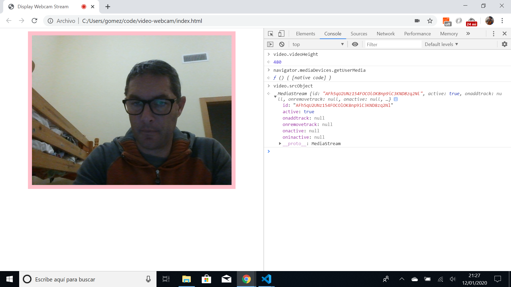

# :zap: HTML Javascript Webcam

* Uses HTML and javascript to view video from a local webcam.
* **Note:** to open web links in a new window use: _ctrl+click on link_


## :page_facing_up: Table of contents

* [:zap: HTML Javascript Webcam](#zap-html-javascript-webcam)
  * [:page_facing_up: Table of contents](#page_facing_up-table-of-contents)
  * [:books: General info](#books-general-info)
  * [:camera: Screenshots](#camera-screenshots)
  * [:signal_strength: Technologies](#signal_strength-technologies)
  * [:floppy_disk: Setup](#floppy_disk-setup)
  * [:computer: Code Examples](#computer-code-examples)
  * [:cool: Features](#cool-features)
  * [:clipboard: Status & To-Do List](#clipboard-status--to-do-list)
  * [:clap: Inspiration](#clap-inspiration)
  * [:file_folder: License](#file_folder-license)
  * [:envelope: Contact](#envelope-contact)

## :books: General info

* Works in Google Chrome & internet explorer.

## :camera: Screenshots

.

## :signal_strength: Technologies

* Ran in Google Chrome browser with: [Javascript engine V8 for Windows (x64)](https://v8.dev/).

## :floppy_disk: Setup

* Open index.html in browser. If any code is changed the browser needs to be refreshed.

## :computer: Code Examples

* code for accessing the getUserMedia API:

```javascript
if (navigator.mediaDevices.getUserMedia) {
    navigator.mediaDevices.getUserMedia({audio: false, video: true}) //constraints in ({})
  .then(function(stream) {
    video.srcObject = stream; //set stream to video source element property
  })
  .catch(function(error) { //catch any errors here
    console.log("Something went wrong!");
  });
}
```

## :cool: Features

* Uses the latest `video.srcObject` to show video data.

## :clipboard: Status & To-Do List

* Status: Working. Checked june 2021.
* To-Do: Nothing.

## :clap: Inspiration

* [Kirupa article: Accessing Your Webcam in HTML](https://www.kirupa.com/html5/accessing_your_webcam_in_html5.htm)
* [MDN Web Docs: MediaDevices.getUserMedia()](https://developer.mozilla.org/en-US/docs/Web/API/MediaDevices/getUserMedia)

## :file_folder: License

* This project is licensed under the terms of the MIT license.

## :envelope: Contact

* Repo created by [ABateman](https://github.com/AndrewJBateman), email: gomezbateman@yahoo.com
